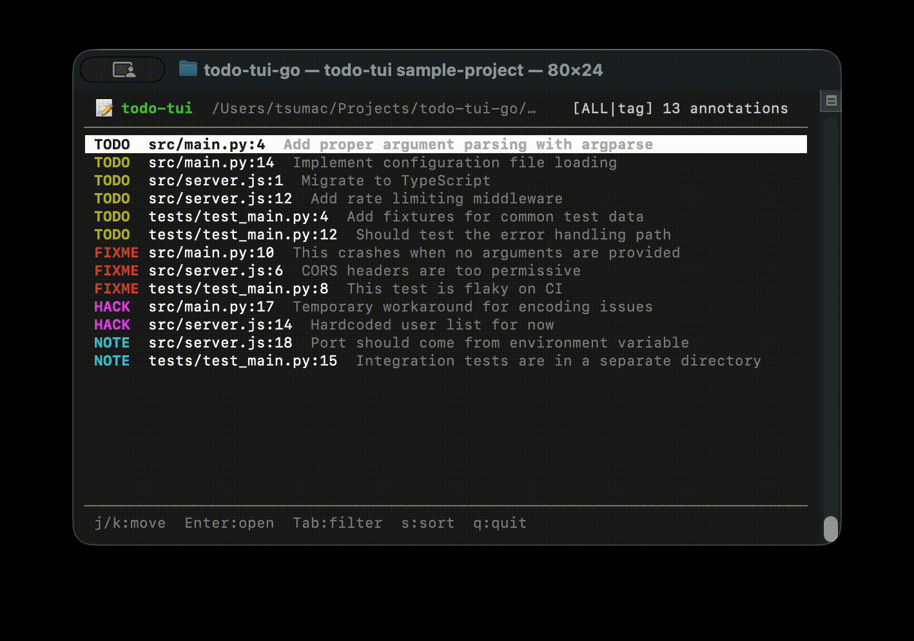

# todo-tui

A TUI tool for browsing and jumping to `TODO` / `FIXME` / `HACK` / `NOTE` annotations without leaving your terminal.

## Features

- **Single binary**: Zero external dependencies. Built with Go standard library only
- **Fast scanning**: Recursively walks directories to collect annotations
- **Tag filtering**: Switch between TODO / FIXME / HACK / NOTE with a single key
- **Editor integration**: Press Enter to open vim/nvim/nano directly at the annotation line
- **Color-coded tags**: TODO=yellow, FIXME=red, HACK=purple, NOTE=cyan

## Demo



## Installation

### go install

Requires Go 1.22 or later.

```bash
go install github.com/Tsuuuuuuun/todo-tui@latest
```

### Build from source

```bash
# Clone and build
git clone https://github.com/Tsuuuuuuun/todo-tui.git
cd todo-tui
make build

# Install to ~/.local/bin
make install

# Uninstall
make uninstall
```

## Usage

```bash
# Scan the current directory
todo-tui

# Scan a specific directory
todo-tui ./my-project

# Try with the bundled sample project
todo-tui sample-project
```

## Key Bindings

### Normal Mode

| Key | Action |
|-----|--------|
| `↑` / `k` | Move selection up |
| `↓` / `j` | Move selection down |
| `Enter` | Open file in editor (jumps to the annotation line) |
| `Tab` | Cycle filter (ALL → TODO → FIXME → HACK → NOTE → ALL …) |
| `/` | Enter command mode |
| `q` | Quit |

### Command Mode

Press `/` to open the command input bar.

| Command | Action |
|---------|--------|
| `/todo` | Show TODO only |
| `/fixme` | Show FIXME only |
| `/hack` | Show HACK only |
| `/note` | Show NOTE only |
| `/all` | Show all |
| `/q` | Quit |
| `Esc` | Cancel command mode |

## Editor Configuration

Set the `$EDITOR` environment variable to specify which editor to use.
Defaults to `vim` if not set.

```bash
export EDITOR=vim
export EDITOR=nvim
export EDITOR=nano
```

For vim / nvim / nano, the editor jumps directly to the annotation line.

## Supported Annotation Formats

| Comment style | Example languages |
|---|---|
| `#` | Python, Ruby, Shell, YAML |
| `//` | JavaScript, TypeScript, Go, Rust, Java, C/C++ |
| `/* */` | JavaScript, Java, C, CSS |
| `<!-- -->` | HTML, XML, Markdown |
| `--` | SQL, Lua, Haskell |

## Ignored Paths

- **Directories**: `.git`, `node_modules`, `__pycache__`, `.venv`, `dist`, `build`, `.next`, `.cache`, `target`, `.idea`, `.vscode`
- **Files**: Binaries, images, archives, fonts, etc. (detected by extension)
- **Size**: Files larger than 1MB are skipped

## Platform Support

Currently supports Unix-based systems (macOS / Linux) only.
This is because raw terminal mode control uses Unix syscalls directly.
Adding Windows support would require introducing `golang.org/x/term` or implementing Windows Console API.

## License

MIT
